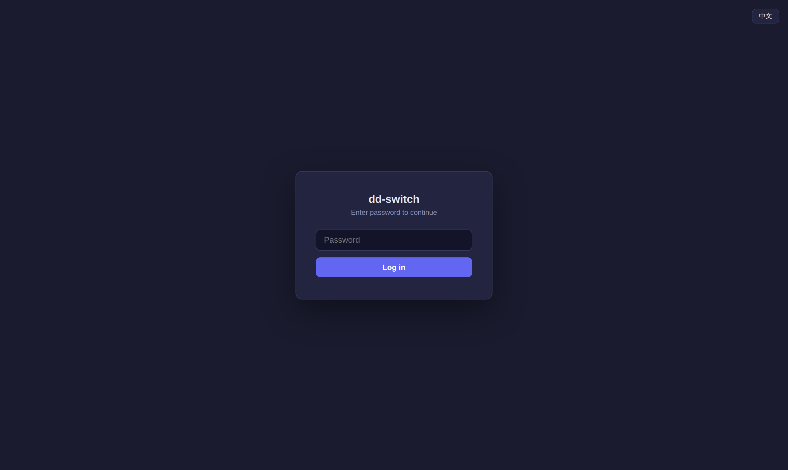
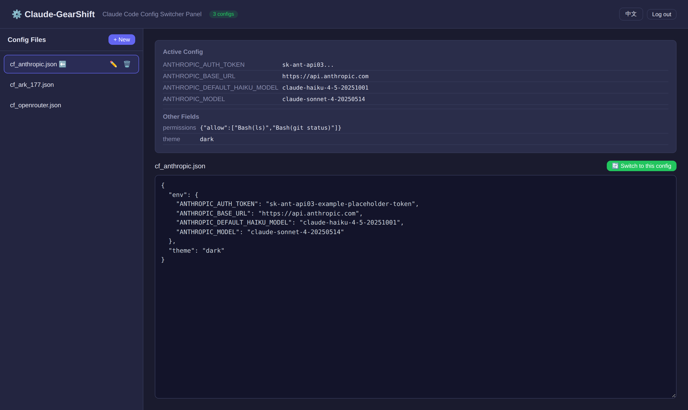
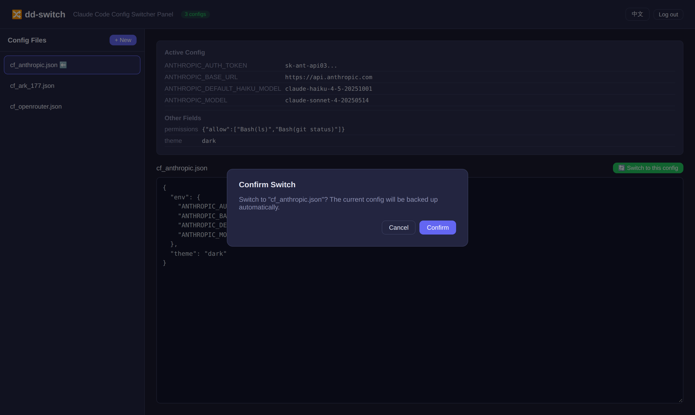

# ⚙️ Claude-GearShift

**English | [简体中文](README.zh-CN.md)**

Shift gears for Claude Code — quickly switch model/provider configs on Linux while leaving every other setting untouched.

Two ways to use it, sharing the same `config/` directory and the same switch semantics (replace `env` only → atomic write):

| Mode | Path | Description |
|---|---|---|
| CLI script | `switch_claude_config.sh` | Interactive menu, `bash` + `jq` |
| Web UI | `dd-switch/` | Flask + waitress, browser-based, password-protected |

## CLI Script Usage

```bash
# Reads configs from ./config/ by default
./switch_claude_config.sh

# Or point it at another config directory
./switch_claude_config.sh ~/.claude/configs/
```

## Web UI Usage

```bash
cd dd-switch
python3 app.py
# open http://localhost:10086
```

Requires `flask` + `waitress` + `paramiko` + `cryptography` — `pip install flask waitress paramiko cryptography`.

- Set the access password via the `DD_SWITCH_PASSWORD` env var (defaults to `admin`)
  > **Deployment note:** always set `DD_SWITCH_PASSWORD` in production — without it, the UI falls back to the default password `admin`.
- Production mode serves via waitress; `DD_SWITCH_DEBUG=1` falls back to Flask's dev server
- Browse / create / edit / delete / switch configs under `config/` right from the page
- 中/EN language toggle in the top-right corner (your choice is remembered)
- Same switch semantics as the CLI script — both can be used interchangeably

### Multi-Server SSH Support

Manage Claude Code configs on **multiple remote servers** from one Web UI:

- **SSH key-based authentication** — supports encrypted keys with passphrase
- **Passphrase encryption** — SSH key passphrases are encrypted with your Web UI login password (PBKDF2 + Fernet), never stored in plain text
- **Automatic operation** — once logged in, SSH connections are established automatically without re-entering credentials
- **Remote config management** — read, switch, and scan configs on remote servers via SSH/SFTP
- **Server management** — add / edit / delete / test servers from the sidebar

> **Note:** Remote servers use the fixed path `~/.claude/settings.json`.

### 🔒 Password Protection

The Web UI is **password-protected end to end** — every page and every API endpoint requires a valid login session:

| Layer | Behavior |
|---|---|
| **Login** | Password comes from `DD_SWITCH_PASSWORD` (default `admin` — always override it in production) |
| **Session** | Server-side token stored in an `HttpOnly` cookie, 8-hour expiry, `SameSite=Lax` |
| **Coverage** | Unauthenticated page visits redirect to the login screen; unauthenticated API calls return `401` + `login_required` |
| **Cache safety** | All responses carry `no-store` headers — config contents never linger in the browser cache |
| **Token masking** | API tokens shown in the UI are truncated (`sk-ant-api03...`), never rendered in full |
| **Logout** | The Log out button invalidates the session server-side immediately |



### Screenshots

| Dashboard | Confirm switch |
|---|---|
|  |  |

## Config Directory Structure

Drop one JSON file per provider into `config/`:

```
config/
├── cf_ark_177.json
├── cf_anthropic.json
├── cf_openrouter.json
└── cf_aws_bedrock.json
```

Each JSON only needs an `env` block, for example:

```json
{
  "env": {
    "ANTHROPIC_AUTH_TOKEN": "sk-ant-...",
    "ANTHROPIC_BASE_URL": "https://api.anthropic.com",
    "ANTHROPIC_MODEL": "claude-sonnet-4-20250514"
  }
}
```

More optional fields: [Claude Code environment variables](https://docs.anthropic.com/en/docs/claude-code/settings).

## Features

| Step | What it does |
|---|---|
| **Scan** | Walks the config directory for `.json` files |
| **Validate** | Syntax-checks each file with `jq`; invalid files are skipped with the reason |
| **Summarize** | Shows the current config's Base URL and Model |
| **Select** | Interactive menu to pick a config |
| **Preview** | Prints the full selected file before switching |
| **Confirm** | Switches only after explicit confirmation |
| **Back up** | Web UI backs up the current config to `settings.json.bak.<timestamp>` before switching; the CLI script overwrites directly |
| **Merge** | Replaces only `env`, preserving `theme` / `permissions` / `actions` / `skills` |
| **Atomic write** | Temp file + `mv rename` — no half-written JSON |
| **Multi-server** | Manage configs on multiple remote servers via SSH key auth |
| **Passphrase encryption** | SSH key passphrases encrypted with Web UI password (PBKDF2 + Fernet) |

## Dependencies

- `bash` 4.0+ (`mapfile` support)
- `jq` (required — JSON validation & merge)

Install `jq`:

```bash
# Ubuntu/Debian
sudo apt install jq

# macOS
brew install jq

# Arch Linux
sudo pacman -S jq
```

## Workflow Example

```bash
# 1. Prepare configs
mkdir -p config
cp ~/.claude/settings.json config/cf_default.json
# edit or fetch additional configs

# 2. Switch
./switch_claude_config.sh
```

```
════════════════════════════════════════════
 JSON 文件校验结果 / JSON Validation Results
════════════════════════════════════════════

  ✅ 有效文件: 3 个 / Valid files: 3

════════════════════════════════════════════
 当前配置 / Current Config
════════════════════════════════════════════
   路径 / Path: /home/user/settings.json
   Base URL: https://ark.cn-beijing.volces.com/api/coding
   Model:    deepseek-v4-flash

════════════════════════════════════════════
 请选择要切换的配置文件 / Select a config file:
════════════════════════════════════════════

1) config/cf_anthropic.json
2) config/cf_ark_177.json
3) config/cf_openrouter.json

请输入编号 (或 0 退出) / Enter a number (or 0 to quit):
```
