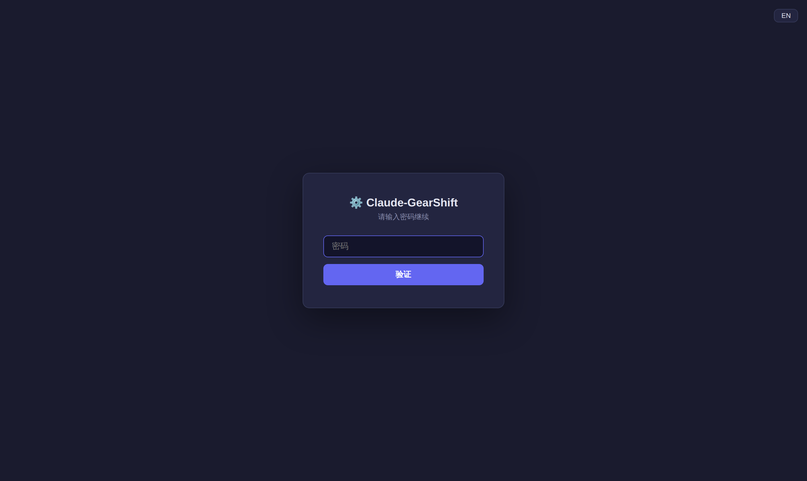
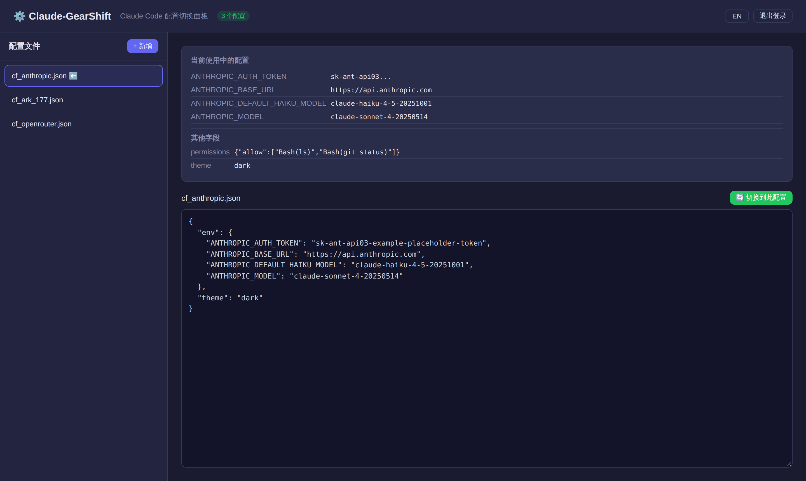

# ⚙️ Claude-GearShift

**[English](README.md) | 简体中文**

给 Claude Code 换挡 —— 在 Linux 上快速切换模型/供应商配置，保留其他设置不变。

提供两种使用方式，共用同一个 `config/` 目录和同一套切换逻辑（只替换 `env` → 原子写入）：

| 方式 | 路径 | 说明 |
|---|---|---|
| 终端脚本 | `switch_claude_config.sh` | 交互式菜单，`bash` + `jq` |
| Web UI | `dd-switch/` | Flask + waitress，浏览器操作，密码保护 |

## 终端脚本用法

```bash
# 默认从 ./config/ 目录读取配置
./switch_claude_config.sh

# 指定配置目录
./switch_claude_config.sh ~/.claude/configs/
```

## Web UI 用法

```bash
cd dd-switch
python3 app.py
# 打开 http://localhost:10086
```

需要 `flask` + `waitress` + `paramiko` + `cryptography`（`pip install flask waitress paramiko cryptography`）。

- 访问密码通过环境变量 `DD_SWITCH_PASSWORD` 设置（不设则默认 `admin`）
  > **部署提醒：** 生产环境务必设置 `DD_SWITCH_PASSWORD`，否则会回退到默认密码 `admin`。
- 生产模式 waitress；`DD_SWITCH_DEBUG=1` 时走 Flask dev server
- 页面可直接查看 / 新建 / 编辑 / 删除 / 切换 `config/` 下的配置
- 右上角 中/EN 语言切换（记忆选择）
- 切换逻辑与终端脚本一致，两种方式可混用

### 多服务器 SSH 支持

在一个 Web UI 中管理**多台远程服务器**的 Claude Code 配置：

- **SSH 密钥认证** — 支持加密密钥和密码短语
- **密码短语加密** — SSH 密钥密码短语使用 Web UI 登录密码加密存储（PBKDF2 + Fernet），绝不明文保存
- **自动操作** — 登录后自动建立 SSH 连接，无需重复输入凭证
- **远程配置管理** — 通过 SSH/SFTP 读取、切换、扫描远程服务器上的配置
- **服务器管理** — 侧边栏添加 / 编辑 / 删除 / 测试服务器连接

> **注意：** 远程服务器使用固定路径 `~/.claude/settings.json`。

### 🔒 密码保护

Web UI **全程密码保护** —— 每个页面、每个 API 接口都必须持有有效的登录会话：

| 层 | 行为 |
|---|---|
| **登录** | 密码来自 `DD_SWITCH_PASSWORD`（默认 `admin` —— 生产环境务必覆盖） |
| **会话** | 服务端 token 存于 `HttpOnly` cookie，8 小时过期，`SameSite=Lax` |
| **覆盖范围** | 未登录访问页面 → 跳转登录页；未登录调用 API → 返回 `401` + `login_required` |
| **缓存安全** | 所有响应带 `no-store` 头 —— 配置内容不会滞留在浏览器缓存 |
| **token 脱敏** | 界面上显示的 API token 一律截断（`sk-ant-api03...`），从不完整渲染 |
| **登出** | 点击退出登录立即在服务端作废会话 |



### 截图

| 主面板 | 切换确认 |
|---|---|
|  |  |

## 配置目录结构

将各份 Claude Code 配置 JSON 文件放入 `config/` 目录：

```
config/
├── cf_ark_177.json
├── cf_anthropic.json
├── cf_openrouter.json
└── cf_aws_bedrock.json
```

每个 JSON 只需包含 `env` 字段，例如：

```json
{
  "env": {
    "ANTHROPIC_AUTH_TOKEN": "sk-ant-...",
    "ANTHROPIC_BASE_URL": "https://api.anthropic.com",
    "ANTHROPIC_MODEL": "claude-sonnet-4-20250514"
  }
}
```

更多可选字段可参考 [Claude Code 环境变量](https://docs.anthropic.com/en/docs/claude-code/settings)。

## 功能

| 步骤 | 说明 |
|---|---|
| **遍历** | 扫描指定目录下所有 `.json` 文件 |
| **校验** | 使用 `jq` 检测 JSON 语法错误，无效文件跳过并列出原因 |
| **展示** | 显示当前配置的 Base URL 和 Model |
| **选择** | 交互菜单选择要切换的配置 |
| **预览** | 切换前展示选中文件的完整内容 |
| **确认** | 确认后才执行切换 |
| **备份** | Web UI 切换前自动备份原配置到 `settings.json.bak.<时间戳>`；终端脚本直接覆盖，不备份 |
| **合并** | 只替换 `env`（模型配置），保留 `theme` / `permissions` / `actions` / `skills` 等其他字段 |
| **原子写入** | 临时文件 → `mv rename`，避免半写导致 JSON 损坏 |
| **多服务器** | 通过 SSH 密钥认证管理多台远程服务器 |
| **密码短语加密** | SSH 密钥密码短语使用 Web UI 密码加密（PBKDF2 + Fernet） |

## 依赖

- `bash` 4.0+（`mapfile` 支持）
- `jq`（必需，JSON 校验与合并）

安装 `jq`：

```bash
# Ubuntu/Debian
sudo apt install jq

# macOS
brew install jq

# Arch Linux
sudo pacman -S jq
```

## 工作流程示例

```bash
# 1. 准备配置
mkdir -p config
cp ~/.claude/settings.json config/cf_default.json
# 手动编辑或下载其他配置

# 2. 切换
./switch_claude_config.sh
```

```
════════════════════════════════════════════
 JSON 文件校验结果 / JSON Validation Results
════════════════════════════════════════════

  ✅ 有效文件: 3 个 / Valid files: 3

════════════════════════════════════════════
 当前配置 / Current Config
════════════════════════════════════════════
   路径 / Path: /home/user/settings.json
   Base URL: https://ark.cn-beijing.volces.com/api/coding
   Model:    deepseek-v4-flash

════════════════════════════════════════════
 请选择要切换的配置文件 / Select a config file:
════════════════════════════════════════════

1) config/cf_anthropic.json
2) config/cf_ark_177.json
3) config/cf_openrouter.json

请输入编号 (或 0 退出) / Enter a number (or 0 to quit):
```
